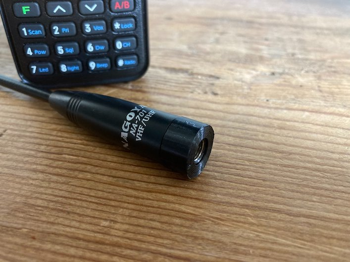

# tyt-sma-antenna-shim

> 6/1/2021 Update: This project is still in-progress as grounding issues need to be sorted out.  As-is, using the NA-701 with the spacer shim results in worse performance than using it without the shim.

## Description

The antenna that ships with the Chinese TYT TH-UV88 HT amateur radio has a much wider base than most aftermarket antennas, because those aftermarket antennas are designed primarily to be used with Japanese HTs which ship with antennas featuring much more narrow antenna mounts.  As a result of how the TH-UV88 was designed in comparison to its Japanese bretheren, [there exists a significant gap](media/005.jpeg) between the outmost portion of an antenna like the Nagoya NA-701 and the antenna molding on the radio itself.

This project aims to design and 3D print a spacer shim to bridge the cap so as to provide increased torquing protection should the radio ever fall and land on its antenna.  The last thing anyone wants is a broken SMA connector.